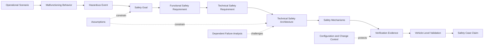
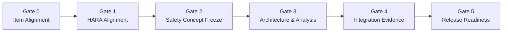

# Automotive Functional Safety Engineering Playbook

### From hazard identification to release evidence

[](#)
[](#)
[](#)
[](#)

**Author:** Hamza Alzakarneh  
**Engineering focus:** Automotive electronics · Circuit and PCB design · Hardware/software validation · Failure analysis · Functional safety

> This repository is an engineering playbook, not a copy of the ISO 26262 standard. It organizes functional-safety work into practical decisions, reusable artifacts, technical evidence, and review gates.

---

## Why this repository exists

Functional safety is not achieved by producing disconnected documents or adding diagnostics at the end of development. It is achieved when the project can maintain one defensible chain:

```text
Vehicle hazard
    → safety goal
        → allocated requirement
            → architecture and safety mechanism
                → verified implementation
                    → vehicle-level validation evidence
```

This playbook turns that chain into a working engineering system. It is designed for automotive engineers who need to connect system safety, hardware design, embedded software, validation, supplier evidence, and release readiness.

---

## The safety case, visualized



The diagram is intentionally evidence-driven. Every arrow represents a traceability obligation, and every side input represents a condition that can weaken the safety argument if it is not controlled.

---

## The five-layer engineering model

| Layer | Engineering intent | Typical output |
|---|---|---|
| **1 — Risk** | Define the item, malfunctioning behavior, operational context, and unacceptable vehicle-level outcomes | Item definition, HARA, safety goals |
| **2 — Requirements** | Convert safety intent into measurable and allocated behavior | FSC, TSC, FSRs, TSRs, interface requirements |
| **3 — Architecture** | Build fault containment, monitoring, independence, and safe/degraded behavior into the design | Safety architecture, timing budget, DFA, interface controls |
| **4 — Implementation** | Realize the safety concept in hardware, software, calibration, diagnostics, and manufacturing controls | Schematics, software, FMEDA, design reviews, testability |
| **5 — Evidence** | Demonstrate that the released configuration satisfies the safety intent | Verification, fault injection, validation, safety case, release decision |

A mature project keeps all five layers synchronized. A requirement change at Layer 2 can invalidate analysis at Layer 3 and evidence at Layer 5.

---

## Repository operating model

This repository is organized around **industry deliverables**, not textbook chapters.

| Deliverable | Purpose | Repository asset |
|---|---|---|
| Safety case structure | Organize claims, assumptions, evidence, and unresolved risk | [Safety Case Architecture](docs/01-safety-case-architecture.md) |
| Item and risk definition | Establish boundaries, use cases, malfunctions, and HARA logic | [Item & HARA Blueprint](docs/02-item-and-hara-blueprint.md) |
| Requirement system | Preserve traceability from safety goal to verification result | [Requirements & Traceability](docs/03-requirements-and-traceability.md) |
| Technical architecture | Define monitoring, independence, timing, and safe/degraded behavior | [Technical Safety Architecture](docs/04-technical-safety-architecture.md) |
| Hardware assurance | Build FMEDA, FTA, DFA, WCCA, diagnostics, and validation into one hardware argument | [Hardware Safety Evidence](docs/05-hardware-safety-evidence.md) |
| Software and integration assurance | Control behavior, timing, interfaces, freedom from interference, and integration evidence | [Software & Integration Evidence](docs/06-software-and-integration-evidence.md) |
| Fault-injection campaign | Prove fault detection and reaction under realistic operating conditions | [Fault-Injection Validation](docs/07-fault-injection-validation.md) |
| Release governance | Decide whether evidence is complete, coherent, controlled, and releasable | [Release Readiness](docs/08-release-readiness.md) |
| Worked safety case | Show the complete chain for unintended electric-drive torque | [Unintended Torque Example](examples/unintended-torque-safety-case.md) |
| Reusable work products | Accelerate new projects with consistent engineering artifacts | [Templates](templates/) and [Data Sheets](data/) |

---

## Industry review gates



| Gate | Exit condition |
|---|---|
| **Gate 0 — Item Alignment** | Scope, interfaces, operating modes, assumptions, and responsibilities are agreed |
| **Gate 1 — HARA Alignment** | Hazardous events are consistently classified and each safety-relevant event has an approved safety goal |
| **Gate 2 — Safety Concept Freeze** | FSRs, safe/degraded states, FTTI assumptions, and external dependencies are allocated |
| **Gate 3 — Architecture & Analysis** | TSRs, safety mechanisms, independence assumptions, hardware/software analyses, and verification methods are coherent |
| **Gate 4 — Integration Evidence** | Requirements are verified on the intended configuration, including fault response and timing |
| **Gate 5 — Release Readiness** | Safety case claims are supported, anomalies are dispositioned, configuration is controlled, and residual risk is visible |

The gate structure is not intended to make development purely sequential. Changes are expected; the purpose is to expose what must be re-opened when an assumption, architecture element, or requirement changes.

---

## Safety Mechanism Canvas

The **Safety Mechanism Canvas** is the core reusable artifact in this playbook. It prevents a diagnostic from being described only as “present” and instead forces the complete safety argument to be recorded.

| Canvas field | Engineering content |
|---|---|
| Controlled hazard | Hazardous behavior and safety goal supported |
| Allocated requirement | FSR/TSR identifier and ASIL allocation |
| Fault model | Exact failure modes the mechanism is expected to detect or control |
| Detection path | Signal source, monitor, thresholds, debounce, test interval, and diagnostic logic |
| Timing budget | Detection, confirmation, communication, processing, and actuation allocations |
| Reaction | Output inhibition, reset, isolation, degradation, warning, or continued operation |
| Resulting state | Defined safe state or degraded operating state |
| Residual faults | Failure modes not controlled by the mechanism |
| Dependencies | Shared power, clock, software, communication, environment, or calibration |
| Verification evidence | Review, analysis, boundary test, fault injection, timing capture, and coverage result |

Use the ready-to-fill version here: [Safety Mechanism Canvas](templates/safety-mechanism-canvas.md).

---

## Worked engineering thread: unintended propulsion torque

The worked example follows one safety thread through the complete repository:

1. A vehicle operating situation and malfunction are combined into a hazardous event.
2. A safety goal is defined without prematurely selecting an implementation.
3. Functional behavior is allocated to command plausibility, independent monitoring, and torque inhibition.
4. The technical architecture separates the primary control path from the monitoring and reaction path.
5. Hardware and software failure modes are analyzed against the safety goal.
6. A fault-injection campaign verifies detection, reaction, timing, diagnostics, and resulting state.
7. Evidence is indexed into a release-level safety case.

[Open the worked example →](examples/unintended-torque-safety-case.md)

---

## Functional-safety definition of done

A safety-related function is not “done” because nominal testing passed. It is ready for release only when the following statements are defensible:

- The item boundary and external assumptions match the released vehicle context.
- Every safety goal traces to implemented and verified requirements.
- Safety mechanisms have explicit fault models, timing allocations, reactions, and residual-fault analysis.
- Independence claims are supported by dependent-failure analysis rather than architecture diagrams alone.
- Hardware metrics and quantitative analyses use controlled assumptions and traceable failure-rate data.
- Fault injection demonstrates the complete fault-to-reaction path under representative operating conditions.
- Test evidence identifies hardware, software, calibration, scripts, tools, and equipment configuration.
- Open anomalies are assessed for safety impact and have approved disposition.
- The safety case shows both supporting evidence and known limitations.

---

## Reusable project assets

### Markdown work-product templates

- [Item Definition Template](templates/item-definition-template.md)
- [Safety Requirement Template](templates/safety-requirement-template.md)
- [Safety Mechanism Canvas](templates/safety-mechanism-canvas.md)
- [Fault-Injection Test Record](templates/fault-injection-test-record.md)
- [Safety Case Evidence Index](templates/safety-case-evidence-index.md)
- [Release Readiness Review](templates/release-readiness-review.md)

### Spreadsheet-ready data sheets

- [HARA Register](data/hara-register.csv)
- [Requirements Traceability Matrix](data/requirements-traceability-matrix.csv)
- [Fault-Injection Campaign Matrix](data/fault-injection-campaign-matrix.csv)
- [Safety Evidence Index](data/safety-evidence-index.csv)

The CSV files are intentionally tool-neutral. They can be imported into Excel, requirements-management platforms, test-management systems, or analytics workflows.

---

## Engineering principles

1. **ASIL is contextual.** It originates from hazardous-event classification and flows through the safety requirements; it is not a generic quality label attached to a part.
2. **Diagnostics require a fault model.** A monitor cannot be credited without defining what it detects, under which conditions, within what time, and with what residual exposure.
3. **Redundancy is not independence.** Two channels that share a vulnerable supply, clock, requirement, or communication path can fail together.
4. **Timing is architectural.** FTTI compliance must include detection, confirmation, communication, processing, and actuation—not only software execution time.
5. **Evidence is configuration-specific.** A passing result has limited safety value when the tested hardware, software, calibration, tool, or script version is unknown.
6. **Safe behavior is context-dependent.** Immediate shutdown may be safe for one function and hazardous for another; degraded or fail-operational behavior may be required.
7. **The safety case must expose uncertainty.** Assumptions, exclusions, anomalies, and residual risks belong inside the argument, not outside it.

---

## Scope boundary

This playbook focuses on hazards caused by malfunctioning behavior of automotive electrical and electronic systems. Projects involving automated driving, connected functions, or complex perception may also require coordinated work in SOTIF, automotive cybersecurity, systems engineering, product safety, reliability, and regulatory compliance.

---

## About the author

Hamza Alzakarneh is an electrical engineer working across automotive electronics, circuit and PCB design, embedded and test software, hardware/software validation, WCCA, DFMEA/FMEDA activities, failure analysis, and production test engineering. This repository reflects a systems-level approach: connecting design decisions to measurable safety evidence.

[Engineering Portfolio](https://hamzaalumich.github.io/)

---

## Use and attribution

The material is an original educational and engineering organization of functional-safety concepts. It does not reproduce the licensed ISO 26262 text and must not replace a project’s approved safety plan, customer requirements, legal obligations, or official standard.
