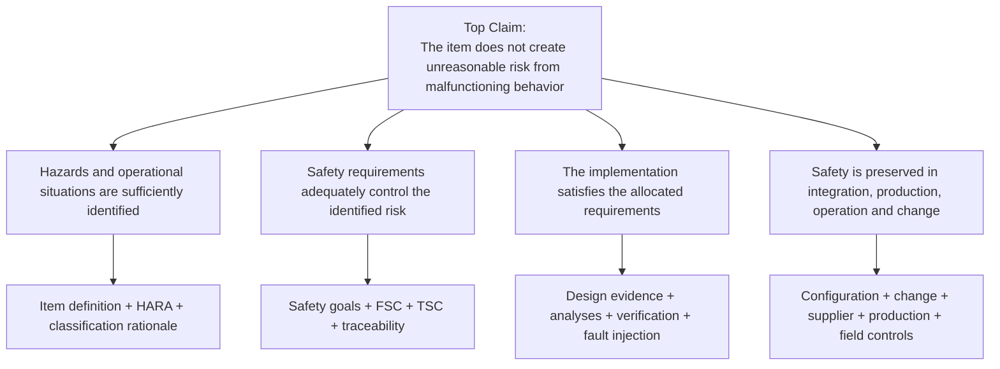

# Safety Case Architecture

## Purpose

A safety case is the organized argument that the item is acceptably safe for its intended context. It should not be treated as a final report assembled after testing. The safety case is an engineering architecture that grows with the product.

## Claim–Argument–Evidence pattern

## Safety case layers

### 1. Context

The argument begins with the exact product configuration, intended use, vehicle context, interfaces, operating modes, and assumptions. A claim is only valid inside this context.

### 2. Risk argument

The project demonstrates that foreseeable malfunctioning behavior and operational situations were analyzed consistently, that safety goals represent the unacceptable outcomes, and that classification decisions have documented rationale.

### 3. Design argument

The project demonstrates that safety goals are converted into requirements, requirements are allocated to architecture elements, safety mechanisms are adequate for their fault models, and dependencies do not defeat the intended risk reduction.

### 4. Evidence argument

The project demonstrates that each requirement has suitable verification, fault reactions are validated within timing constraints, quantitative analyses use controlled data, and the evidence corresponds to the released configuration.

### 5. Lifecycle argument

The project demonstrates that safety is maintained through supplier interfaces, configuration control, manufacturing, calibration, service, changes, field monitoring, and decommissioning where applicable.

## Evidence quality rules

Evidence is strong when it is:

- directly linked to a claim or requirement;
- produced using defined acceptance criteria;
- repeatable or reviewable;
- tied to a unique configuration;
- generated with controlled tools and methods;
- representative of the intended operating context; and
- explicit about limitations and unresolved anomalies.

## Evidence index structure

| Field | Meaning |
|---|---|
| Claim ID | Safety case claim supported |
| Requirement ID | Source requirement, when applicable |
| Evidence ID | Unique controlled record |
| Evidence type | Review, analysis, test, inspection, simulation, field result |
| Configuration | Hardware, software, calibration, script, and tool versions |
| Result | Pass, fail, conditional pass, open |
| Limitation | Boundary, assumption, exclusion, uncertainty |
| Owner | Responsible engineer or organization |
| Approval | Review status and authority |

Use the [Safety Case Evidence Index](../templates/safety-case-evidence-index.md) or the [CSV version](../data/safety-evidence-index.csv).

## Safety case anti-patterns

- A list of documents with no claim structure.
- Requirements marked verified without acceptance criteria.
- Safety mechanisms credited without fault-model boundaries.
- Architecture independence asserted without dependent-failure analysis.
- Test reports that do not identify the tested configuration.
- Open anomalies hidden outside the release argument.
- Supplier assumptions copied into a safety manual but never verified during integration.
