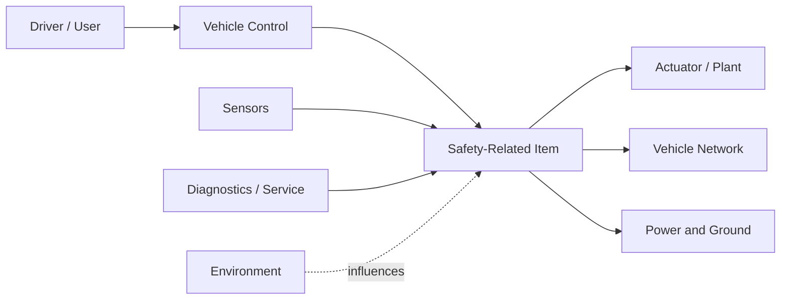

# Item and HARA Blueprint

## The item definition as an engineering contract

The item definition establishes the boundary of the safety argument. It should be precise enough that engineers can distinguish:

- behavior owned by the item;
- behavior expected from external systems;
- vehicle-level operating situations;
- interfaces that can introduce or propagate faults;
- degraded and maintenance modes;
- environmental and electrical constraints; and
- assumptions that must remain valid during integration.

A vague item boundary creates hidden safety requirements. A narrow item boundary can incorrectly push safety responsibility into another ECU or supplier.

## Functional boundary map



Each interface should have normal behavior, failure behavior, timing expectations, diagnostic ownership, and safe-state responsibility defined.

## HARA construction method

### Function → malfunction → situation → hazardous event

| Element | Example |
|---|---|
| Intended function | Control electric-drive torque |
| Malfunctioning behavior | Unintended positive torque |
| Operational situation | Vehicle stationary near pedestrians |
| Hazardous event | Unexpected vehicle motion toward pedestrians |

The malfunction is stated independently of the technical root cause. A stuck transistor, corrupted command, software defect, and sensor fault may all create the same malfunctioning behavior and therefore support the same vehicle-level hazard analysis.

## Classification logic

### Severity

Severity reflects the reasonably foreseeable harm to people, including vehicle occupants and other road users.

### Exposure

Exposure reflects the frequency of the operational situation. It is not the component failure rate and not the diagnostic escape probability.

### Controllability

Controllability reflects whether affected persons can reasonably avoid harm after the hazardous behavior becomes present. Warning time, vehicle dynamics, road context, and normal human capability influence the rating.

## HARA quality controls

- Operational situations are specific enough to distinguish materially different risk.
- Classification rationale is written, not only coded as S/E/C values.
- Similar scenarios are classified consistently across functions.
- Credit for warnings or fallback behavior is supported by realistic timing and human response assumptions.
- Every safety-relevant hazardous event produces a safety goal.
- Safety goals remain vehicle-level and implementation-neutral.
- External dependencies identified during HARA are carried into the safety concept.

## Safety goal pattern

A strong safety goal contains:

```text
Prevent or control [hazardous vehicle behavior]
under [relevant operating scope]
within [timing or state constraint, when necessary].
```

Example:

> Prevent unintended drive torque that can create hazardous vehicle motion.

The goal should not immediately prescribe a microcontroller, comparator, relay, or software architecture. Those decisions belong in the safety concepts.

## HARA register

The spreadsheet-ready [HARA Register](../data/hara-register.csv) contains fields for function, malfunction, operating situation, hazardous event, S/E/C rationale, ASIL result, safety goal, assumptions, and review status.
