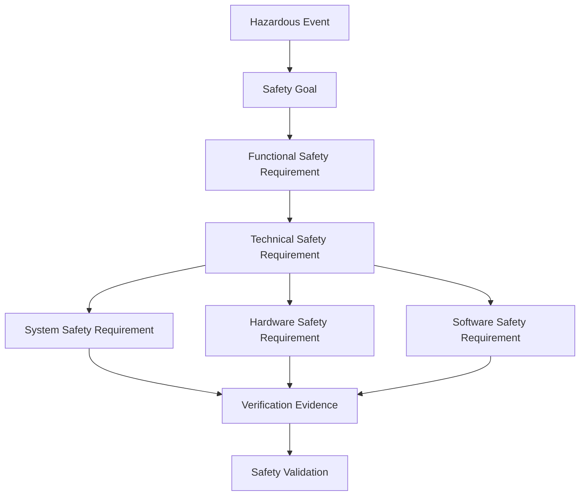

# Safety Requirements and Traceability

## Requirement hierarchy



Each level adds implementation detail while preserving the safety intent and ASIL allocation.

## Requirement quality model

A safety requirement should define:

- required behavior;
- triggering and operating conditions;
- timing constraint;
- interfaces and signals;
- resulting safe or degraded state;
- diagnostic or fault-reporting behavior;
- ASIL allocation;
- assumptions and dependencies;
- verification method; and
- objective acceptance criteria.

### Weak statement

> The ECU shall safely detect current-sensor faults.

### Engineering-grade statement

> When the phase-current signal is outside the valid electrical range for longer than the qualified debounce interval, the control unit shall set the assigned diagnostic status and inhibit positive torque production within the allocated reaction time.

The stronger statement provides a path to implementation, boundary testing, timing measurement, and pass/fail criteria.

## Traceability is bidirectional

Forward traceability ensures that each safety requirement has an implementation and verification result. Backward traceability ensures that every safety-related design feature and test has a valid requirement source.

A complete traceability record connects:

```text
Hazardous Event ↔ Safety Goal ↔ FSR ↔ TSR ↔ Design Element ↔ Test Case ↔ Test Result ↔ Safety Case Claim
```

## Requirement change impact

A change to a threshold, debounce, fault reaction, or interface may affect:

- safety timing;
- FMEDA classification and diagnostic coverage;
- software scheduling;
- fault-injection acceptance criteria;
- communication timeout behavior;
- degraded-state strategy;
- calibration controls; and
- vehicle-level validation.

Change impact should therefore be evaluated across the full traceability chain rather than only inside the edited document.

## Traceability matrix fields

| Field | Purpose |
|---|---|
| Source ID | Hazardous event, safety goal, or parent requirement |
| Requirement ID | Unique identifier |
| ASIL | Allocated integrity level |
| Requirement text | Controlled behavior statement |
| Allocation | System, hardware, software, external element |
| Design reference | Architecture, schematic, software component, calibration |
| Verification method | Review, analysis, test, inspection, simulation |
| Test case and result | Evidence references |
| Status | Draft, approved, implemented, verified, closed |
| Change impact | Linked impact assessment |

Use the [Requirements Traceability Matrix](../data/requirements-traceability-matrix.csv).
