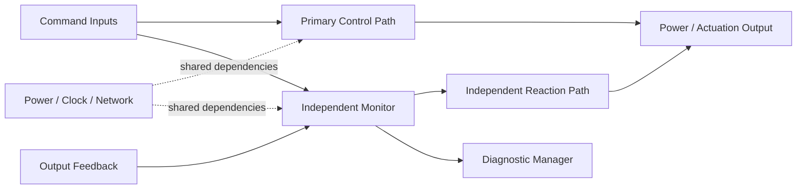

# Technical Safety Architecture

## Architecture objective

The technical safety architecture converts safety requirements into fault containment, monitoring, independence, timing, communication protection, and controlled system behavior.

A safety architecture should make the following paths visible:

1. **Primary functional path** — produces the intended vehicle function.
2. **Monitoring path** — detects incorrect behavior or internal faults.
3. **Reaction path** — forces or requests the defined safe/degraded state.
4. **Diagnostic path** — records, communicates, and preserves fault status.
5. **Recovery path** — controls reset, restart, latching, service, and re-entry.

## Dual-path concept



The architecture diagram is only the beginning. Shared dependencies must be analyzed to determine whether the monitor and reaction path can actually remain effective when the primary path fails.

## Timing budget

A technical safety requirement should allocate the complete fault-to-control timeline:

```text
Fault occurrence
  + detection latency
  + confirmation / debounce
  + communication delay
  + processing and scheduling delay
  + actuation delay
  = total fault reaction time
```

The total must remain within the applicable FTTI or other safety timing constraint, including worst-case operating and scheduling conditions.

## Independence and dependent failures

Potential dependencies include:

- common power rail or regulator;
- common clock or reset source;
- shared microcontroller or software service;
- shared communication bus;
- shared sensor or signal conditioning;
- common calibration or requirement error;
- PCB physical proximity and environmental stress;
- common manufacturing or configuration process; and
- a single shutdown element credited by multiple safety paths.

Dependent-failure analysis should identify the dependency, failure cause, affected safety functions, existing controls, residual risk, and evidence needed to support the independence claim.

## Safe and degraded behavior

A safe state is selected from the vehicle hazard, not from a generic preference for shutdown. The architecture may require:

- immediate output inhibition;
- controlled ramp-down;
- function limitation;
- driver warning and takeover request;
- temporary fail-operational behavior;
- isolation of a failed channel;
- latched shutdown until service; or
- controlled restart after diagnostic confirmation.

The state-transition design should define entry criteria, timing, allowed outputs, diagnostic status, recovery conditions, and behavior under repeated or multiple faults.

## Safety Mechanism Canvas

For each credited mechanism, complete the [Safety Mechanism Canvas](../templates/safety-mechanism-canvas.md). A mechanism should not enter the safety argument until its fault model, timing, reaction, residual faults, dependencies, and verification evidence are explicit.
