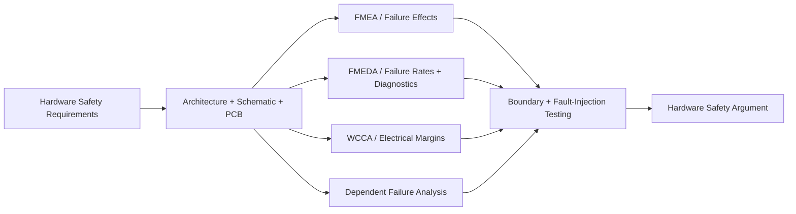

# Hardware Safety Evidence

## Hardware safety argument

The hardware safety argument connects component failure behavior to system-level risk control. It should combine qualitative analysis, quantitative analysis, circuit robustness, diagnostics, and physical verification.

## Analysis roles

### FMEA

FMEA identifies failure modes, local and higher-level effects, existing controls, and recommended actions. It is useful for design-risk understanding and systematic fault prevention.

### FMEDA

FMEDA adds failure-rate data, safety-related fault classification, diagnostic coverage assumptions, residual-fault treatment, and inputs to hardware architectural and quantitative evaluation.

### Fault Tree Analysis

FTA starts from a top event such as safety-goal violation and identifies combinations of faults and conditions that can produce it. It supports architecture reasoning, common-cause discovery, and quantitative evaluation where appropriate.

### Dependent Failure Analysis

DFA challenges assumptions that redundant or monitoring paths are independent. It includes common-cause, cascading, common-mode, and shared-resource dependencies.

### Worst-Case Circuit Analysis

WCCA verifies that the circuit maintains required behavior across component tolerance, supply variation, temperature, aging, leakage, loading, and interface conditions. WCCA does not replace FMEDA, but it strengthens the systematic design argument and helps define realistic diagnostic thresholds and margins.

## Hardware fault classes

A hardware failure can contribute as:

- a single-point fault;
- a residual fault not fully controlled by a safety mechanism;
- a detected or perceived multiple-point fault;
- a latent multiple-point fault;
- a safe fault; or
- a fault outside the analyzed safety context.

Classification must follow the actual safety goal, architecture, and fault effect rather than the component name alone.

## Diagnostic coverage evidence

Diagnostic coverage should be based on an explicit fault population and credited mechanism behavior. The evidence may combine:

- circuit analysis;
- fault simulation;
- FMEDA classification;
- open/short and parametric fault injection;
- boundary-condition testing;
- timing measurements;
- production diagnostic controls; and
- field or reliability data where valid.

A single generic coverage percentage should not be applied across unrelated failure modes.

## PCB and circuit considerations

Functional-safety evidence may depend on physical design details such as:

- independence of power and ground paths;
- separation of redundant channels;
- monitor access to true actuator feedback;
- test-point coverage and production detectability;
- component derating and thermal margin;
- creepage, clearance, and isolation where applicable;
- reset, clock, and watchdog architecture;
- fault containment on communication interfaces; and
- output-stage disable path effectiveness.

## Hardware review package

A mature review package contains:

1. approved hardware safety requirements;
2. architecture and interface diagrams;
3. schematic and PCB revision;
4. BOM and component assumptions;
5. WCCA and design-margin analysis;
6. FMEA/FMEDA/FTA/DFA results;
7. safety-mechanism specifications;
8. verification and fault-injection results;
9. production-test coverage; and
10. open issues, residual faults, and release limitations.
