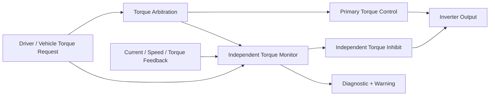

# Worked Safety Thread — Unintended Electric-Drive Torque

> This example is intentionally simplified. It demonstrates safety-case structure rather than defining a vehicle-program solution.

## 1. Vehicle-level context

The item controls positive and negative electric-drive torque using driver requests, vehicle state, inverter feedback, and network information. The safety boundary includes command generation, torque arbitration, inverter command transmission, selected monitoring, and the reaction request. Mechanical braking and some vehicle-level fallback behavior are external dependencies.

## 2. Hazardous event

| Element | Example |
|---|---|
| Function | Electric-drive torque control |
| Malfunction | Unintended positive torque |
| Operational situation | Vehicle stationary or moving slowly near pedestrians or obstacles |
| Hazardous event | Unexpected vehicle motion creates impact risk |
| Safety goal | Prevent unintended drive torque that can create hazardous vehicle motion |

## 3. Functional safety behavior

The functional concept allocates three complementary behaviors:

- validate the torque request using independent input plausibility;
- monitor commanded and achieved torque for disagreement; and
- inhibit or reduce torque through an independent reaction path within the allocated timing budget.

The vehicle-level response may also require driver warning, brake coordination, diagnostic latching, and controlled recovery.

## 4. Technical safety architecture

### Key independence concerns

- shared sensor or input processing;
- common microcontroller and memory;
- common power, clock, or reset;
- monitor using the same corrupted internal variable as the controller;
- shared network message without end-to-end protection;
- reaction path relying on the same software task that may have failed; and
- a single output element that can defeat both control and shutdown.

## 5. Safety Mechanism Canvas — torque disagreement monitor

| Field | Example content |
|---|---|
| Controlled hazard | Unintended positive propulsion torque |
| Requirement | Detect commanded/achieved torque disagreement and control torque within allocated time |
| Fault model | Incorrect command, stale request, control computation fault, selected feedback faults |
| Detection path | Independent calculation compares request, estimated torque, current feedback, and vehicle state |
| Confirmation | Calibrated persistence logic prevents reaction to transient noise while preserving timing margin |
| Reaction | Independent torque-inhibit request and controlled zero/limited torque state |
| Resulting state | Propulsion torque removed or limited; diagnostic latched; driver informed as required |
| Residual faults | Common input corruption, failed monitor, failed inhibit path, undetected output-stage fault |
| Dependencies | Power, clock, reset, communication, calibration, common software services |
| Evidence | Analysis, boundary tests, task timing, communication fault tests, hardware/software fault injection |

## 6. Hardware evidence thread

The hardware analysis considers failures in command conditioning, current sensing, communication interfaces, power supplies, clock/reset, processing hardware, output gating, and feedback circuits. FMEDA classifies the safety relevance of faults and evaluates credited diagnostics. WCCA verifies monitor thresholds and circuit margins across tolerance and environmental conditions. DFA challenges common power, clock, reset, physical, and output-stage dependencies.

## 7. Software evidence thread

Software evidence demonstrates requirements traceability, independent monitoring logic, state transition correctness, timing under worst-case load, protected communication, diagnostic latching, controlled recovery, and freedom from interference where independence is claimed.

## 8. Fault-injection campaign

| Injection | Expected behavior | Evidence |
|---|---|---|
| Torque command frozen high | Disagreement detected; torque inhibited within timing budget | Network log + internal trace + output waveform |
| Feedback signal out of range | Sensor diagnostic set; fallback or inhibit behavior entered | Stimulus record + diagnostic log + torque response |
| Monitor task delayed | Deadline/watchdog mechanism detects failure and activates reaction | Scheduler trace + watchdog output + actuator state |
| Communication sequence error | Message rejected; stale value not used; degraded behavior applied | Bus capture + software log + state transition |
| Output enable stuck active | Independent feedback identifies continued output; higher-level mitigation invoked | Electrical measurement + diagnostic response |
| Shared supply disturbance | Primary and monitor behavior assessed against dependency assumptions | Supply waveform + reset/status + output behavior |

## 9. Safety case conclusion structure

The safety case does not claim that one diagnostic alone prevents unintended torque. It argues that:

1. the vehicle-level hazardous behavior is clearly defined;
2. complementary prevention, detection, and reaction requirements are allocated;
3. the architecture contains suitable monitoring and inhibition paths;
4. common dependencies and residual faults are analyzed;
5. hardware and software implementation evidence supports the requirements;
6. fault injection demonstrates end-to-end timing and resulting state; and
7. the released configuration and external assumptions remain controlled.
