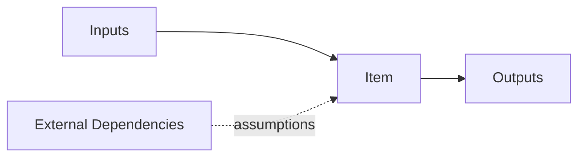

# Item Definition Template

## 1. Item identity

- Item name:
- Program / platform:
- Owner:
- Revision and status:
- Intended vehicle applications:

## 2. Intended functionality

Describe the item’s normal functions, outputs, operating modes, degraded modes, startup/shutdown behavior, and interactions with the driver or road users.

## 3. Boundary and architecture context

- Elements inside the item:
- Elements outside the item:
- Vehicle systems depended upon:
- Safety responsibility split:

## 4. Interfaces

| Interface | Direction | Normal behavior | Failure behavior | Timing | Diagnostic owner | Safety assumption |
|---|---|---|---|---|---|---|
| | | | | | | |

## 5. Operating situations

| Mode / situation | Description | Frequency | Relevant users | Environmental constraints | Safety relevance |
|---|---|---|---|---|---|
| | | | | | |

## 6. Known limitations and assumptions

- Electrical/environmental assumptions:
- External diagnostic assumptions:
- Driver or vehicle response assumptions:
- Supplier assumptions:
- Service/update assumptions:

## 7. Open issues and approvals

| Issue | Safety impact | Owner | Due date | Status / approval |
|---|---|---|---|---|
| | | | | |
